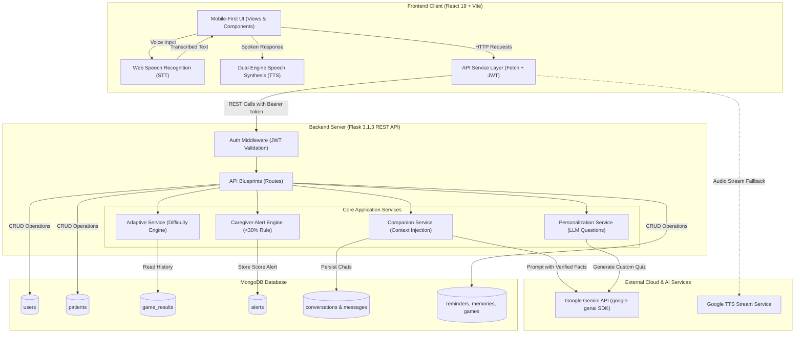

# SmritiRoots (स्मृतिRoots)

> **Play · Remember · Live Better** — An elder-friendly cognitive wellness and dementia care platform connecting patients with adaptive brain exercises, a context-grounded voice companion, and real-time caregiver alerts.

[](https://react.dev/)
[](https://vitejs.dev/)
[](https://www.python.org/)
[](https://flask.palletsprojects.com/)
[](https://www.mongodb.com/)
[](https://ai.google.dev/)
[](https://opensource.org/licenses/MIT)

---

## Table of Contents

- [1. Project Title & Tagline](#1-project-title--tagline)
- [2. Problem Statement](#2-problem-statement)
- [3. Overview](#3-overview)
- [4. Key Features](#4-key-features)
- [5. Impact & Benefits](#5-impact--benefits)
- [6. Tech Stack](#6-tech-stack)
- [7. System Architecture](#7-system-architecture)
- [8. Folder Structure](#8-folder-structure)
- [9. Installation & Setup](#9-installation--setup)
- [10. Environment Variables](#10-environment-variables)
- [11. Usage](#11-usage)
- [12. API Endpoints](#12-api-endpoints)
- [13. Screenshots/Demo](#13-screenshotsdemo)
- [14. Team](#14-team)
- [15. Future Scope](#15-future-scope)
- [16. License](#16-license)

---

## 1. Project Title & Tagline

**SmritiRoots (स्मृतिRoots)**  
*Empowering individuals with cognitive decline through personalized memory stimulation, adaptive cognitive workouts, and intelligent caregiver monitoring.*

---

## 2. Problem Statement

- **Problem Statement ID**: `SIH26003`
- **Domain**: Healthcare / Assistive Technology / Cognitive Wellness & Elderly Care
- **Core Challenge**: Mild Cognitive Impairment (MCI) and early-to-moderate dementia patients often experience progressive memory loss, spatial-temporal disorientation, anxiety, and social isolation. Existing digital solutions suffer from steep cognitive learning curves, overwhelming interfaces, generic non-personalized content, and lack of real-time safety and cognitive decline alerts for family caregivers.

---

## 3. Overview

**SmritiRoots (स्मृतिRoots)** is a full-stack, mobile-first assistive platform engineered specifically for elderly patients experiencing cognitive impairment or dementia (such as Maya Ji) and their dedicated family caregivers. 

The application offers a voice-first conversational AI companion grounded strictly in the patient's personal facts, family circle, and cherished memories to evoke positive reminiscence without medical hallucination. In tandem, it delivers personalized, adaptive cognitive exercises that adjust difficulty in real time based on user performance. For caregivers, SmritiRoots provides a synchronized telemetry dashboard with continuous cognitive tracking and an automated alert system that flags potential cognitive dips whenever session performance falls below a 30% threshold.

---

## 4. Key Features

- **Voice-First AI Companion (Bilingual)**:
  - Supports English (`en-IN`) and Hindi (`hi-IN`) with real-time speech-to-text live typing into the UI.
  - Speech synthesis powered by browser `SpeechSynthesis` with Chrome keep-alive heuristics and Google TTS streaming fallback.
  - Strict server-side grounding guardrails preventing hallucinations, medical prescriptions, or invented family details.
- **Personalized & Adaptive Cognitive Quizzes ("Brain Boost")**:
  - Dynamically synthesizes personalized questions using Google Gemini (`gemini-3.1-flash-lite`, `gemini-3.6-flash`) grounded in the patient's loved ones, favorite routines, and memories.
  - Adaptive difficulty engine dynamically adjusts quiz difficulty across `easy`, `medium`, and `hard` according to recent accuracy trends.
- **Caregiver Alert System (<30% Threshold)**:
  - Real-time detection engine triggers warning notifications whenever a patient's game score or accuracy drops below 30%.
  - Dedicated caregiver notification center with unread counters, in-dashboard banner alerts, and acknowledgment/dismissal workflows.
- **Reminiscence Therapy & Cherished Memories**:
  - Digital memory repository preserving photos, life stories, family milestones, and special places to stimulate neural pathways.
- **Elder-Friendly Routine & Medication Reminders**:
  - Simplified, high-contrast reminder schedule with intuitive single-tap *"Mark as Done"* actions.
- **Elder-Centric Accessibility (a11y) Design**:
  - Oversized touch targets (>62px), high-contrast calming pastel palette (lavender, mint, warm peach), large legible typography, and built-in screen audio read-aloud buttons.
- **Caregiver Oversight & Patient Management**:
  - Multi-patient linking via secure email invitations.
  - Comprehensive telemetry dashboards displaying score progressions, category breakdowns, and session histories.

---

## 5. Impact & Benefits

### Target Impact
- **Elderly Patients with MCI / Dementia**:
  - Stimulates neuroplasticity through daily personalized cognitive puzzles.
  - Alleviates feelings of loneliness, confusion, and agitation through compassionate, voice-first conversation.
  - Enhances daily independence via accessible visual and spoken medication reminders.
- **Family Caregivers & Healthcare Providers**:
  - Provides objective, continuous telemetry on cognitive trends rather than relying solely on sporadic clinical visits.
  - Delivers early warnings via automated alerts when sudden cognitive dips (<30%) occur, facilitating timely clinical interventions.
  - Reduces caregiver anxiety through seamless remote monitoring.

### Key Motivation & Statistics
- [TODO: confirm: Insert specific regional/global dementia prevalence statistics, e.g., 55M+ people living with dementia worldwide, projected to reach 78M by 2030].

---

## 6. Tech Stack

### Frontend
- **Framework / UI Library**: [React 19](https://react.dev/) (`react` 19.2.8, `react-dom` 19.2.8)
- **Build Tool / Bundler**: [Vite 8](https://vitejs.dev/) (`vite` 8.2.0, `@vitejs/plugin-react` 6.0.4)
- **Icons**: [Lucide React](https://lucide.dev/) (`lucide-react` 1.47.0)
- **Code Quality / Linter**: [Oxlint](https://oxc.rs/) (`oxlint` 1.75.0)
- **Styling**: Responsive CSS3 with custom variables, mobile-first flexbox/grid containers, and accessibility-first contrast ratios.
- **Speech APIs**:
  - Speech Recognition: Web Speech API (`webkitSpeechRecognition` / `SpeechRecognition`) with continuous interim stream handling.
  - Speech Synthesis: Dual-engine architecture (`window.speechSynthesis` with utterance keep-alive + Google Translate TTS stream fallback).

### Backend
- **Language / Runtime**: Python 3.10+ (tested on Python 3.14)
- **Framework**: [Flask 3.1.3](https://flask.palletsprojects.com/)
- **CORS Handling**: `flask-cors` 6.0.5
- **Authentication & Security**: `PyJWT` 2.14.0 (JSON Web Tokens), `bcrypt` 5.0.0
- **HTTP Clients**: `requests` 2.34.2, `httpx` 0.28.1
- **Concurrency & Resilience**: Threading-based timeout protection (7.5-second hard execution guard for LLM calls).

### Database
- **Primary Database**: [MongoDB](https://www.mongodb.com/) (Document Database)
- **Database Driver**: [PyMongo 4.18.1](https://pymongo.readthedocs.io/)
- **Collections (10)**:
  - `users` — Caregiver and patient authentication credentials and roles.
  - `patients` — Patient clinical profiles, preferences, and personalization facts.
  - `reminders` — Medication, hydration, and daily routine schedules.
  - `memories` — Photos, descriptions, and emotional anchors.
  - `games` — Cognitive game catalog and metadata.
  - `game_sessions` — Active personalized quiz sessions.
  - `game_results` — Historical scores, accuracy metrics, and time taken.
  - `conversations` — AI companion session threads.
  - `messages` — Chronological conversation exchange turns.
  - `alerts` — Caregiver notifications for scores below the 30% threshold.

### AI / ML Models & APIs
- **LLM Engine**: Google Gemini API via official `google-genai` SDK (v2.24.0)
- **Prioritized Model Hierarchy**:
  1. `gemini-3.1-flash-lite` (Primary low-latency model)
  2. `gemini-3.6-flash`
  3. `gemini-flash-latest`
  4. `gemini-3.5-flash`
- **Fallback Architecture**: Rule-based conversational fallbacks and static cognitive question banks for zero-downtime offline reliability.
- **Secondary Provider Stub**: Groq API integration stub (`BaseAIProvider` interface).

### Cloud / Hosting Services
- [TODO: confirm: Specify production deployment targets, e.g., Render / AWS / GCP / Vercel].

---

## 7. System Architecture

SmritiRoots follows a clean, decoupled **Client-Server RESTful Architecture** paired with asynchronous speech pipelines and external LLM services.

### Architecture Diagram



### Data Flow Explanation

1. **User Voice / Text Interaction**: The patient speaks into the microphone. The browser's `SpeechRecognition` API listens continuously, formats interim transcriptions live onto the screen, and sends the final string to `POST /api/companion/message`.
2. **Context Resolution & Fact Whitelisting**: Flask's authentication middleware validates the JWT token. The `CompanionService` and `ContextService` extract the patient's verified personal memories, routine, and language preferences (`en-IN` or `hi-IN`).
3. **Resilient AI Generation**: The server queries the Google Gemini API with strict instructions that forbid clinical diagnoses or unverified facts. If the Gemini API call exceeds 7.5 seconds or fails, an automated local fallback responds gracefully.
4. **Cognitive Workout & Adaptive Scoring**: When the patient completes a quiz session via `POST /api/game-session/submit`, the backend computes accuracy and score, records the result into `game_results`, and computes the next adaptive difficulty level (`easy`, `medium`, `hard`).
5. **Real-Time Caregiver Alert Trigger**: If the calculated score or accuracy is strictly below 30%, the system automatically generates a warning alert record in `alerts`. Caregivers polling `/api/caregiver/dashboard/<patient_id>` or `/api/caregiver/alerts` instantly receive visual badge indicators and banner warnings.

---

## 8. Folder Structure

```text
Dementia_Cognitive-main/
├── README.md                           # Comprehensive project documentation
├── backend/                            # Flask Python backend
│   ├── .env                            # Local environment configuration (gitignored)
│   ├── .env.example                    # Template environment variables
│   ├── requirements.txt                # Python package dependencies
│   ├── run.py                          # Flask application entry point
│   └── app/                            # Application package
│       ├── __init__.py                 # Flask app factory, CORS, and blueprint registration
│       ├── config/                     # Configuration and database connection
│       │   ├── database.py             # MongoDB client initialization (PyMongo)
│       │   └── settings.py             # Application environment settings
│       ├── middleware/                 # Request interceptors
│       │   ├── auth_middleware.py      # JWT authentication and role enforcement
│       │   └── error_handler.py        # Centralized HTTP error handling
│       ├── models/                     # MongoDB document models & queries
│       │   ├── alert_model.py          # Alert creation, dismissal, and caregiver querying
│       │   ├── conversation_model.py   # AI companion session management
│       │   ├── game_model.py           # Static cognitive game listings
│       │   ├── game_result_model.py    # Game scores and history
│       │   ├── game_session_model.py   # Active game session instances
│       │   ├── memory_model.py         # Cherished memory storage
│       │   ├── message_model.py        # Chat message persistence
│       │   ├── patient_model.py        # Patient details and personalization facts
│       │   ├── question_model.py       # General cognitive question bank
│       │   ├── reminder_model.py       # Medication and routine reminders
│       │   └── user_model.py           # User account and auth records
│       ├── providers/                  # External AI model provider integrations
│       │   ├── __init__.py             # Provider factory
│       │   ├── base_provider.py        # Abstract BaseAIProvider definition
│       │   ├── gemini_provider.py      # Google Gemini client with model failovers
│       │   └── groq_provider.py        # Groq secondary provider stub
│       ├── routes/                     # REST API blueprints
│       │   ├── ai_test_routes.py       # Endpoint for testing Gemini generation
│       │   ├── auth_routes.py          # Registration and login endpoints
│       │   ├── caregiver_routes.py     # Dashboard, linking, and alert management
│       │   ├── companion_routes.py     # Voice AI companion messaging
│       │   ├── game_result_routes.py   # Score submission and difficulty trends
│       │   ├── game_routes.py          # Available games directory
│       │   ├── game_session_routes.py  # Personalized game generation and evaluation
│       │   ├── memory_routes.py        # Patient memory CRUD
│       │   ├── patient_routes.py       # Patient profile operations
│       │   ├── question_routes.py      # Question bank retrieval
│       │   ├── quiz_routes.py          # Static answer validation
│       │   └── reminder_routes.py      # Reminder operations
│       ├── services/                   # Business logic and AI orchestration
│       │   ├── adaptive_service.py     # Dynamic difficulty adjustment logic
│       │   ├── auth_service.py         # User registration and token generation
│       │   ├── companion_service.py    # Voice AI prompt pipeline & fallbacks
│       │   ├── context_service.py      # Patient fact retrieval & context assembly
│       │   ├── game_service.py         # Game processing & alert evaluation
│       │   ├── memory_service.py       # Memory business logic
│       │   ├── patient_service.py      # Patient profile creation logic
│       │   ├── personalization_service.py # Gemini-powered personalized question generation
│       │   └── reminder_service.py     # Reminder operations logic
│       └── utils/                      # Helper utilities
│           ├── response.py             # Standardized JSON response formatters
│           └── validators.py           # Email and payload validators
└── frontend/                           # React + Vite frontend
    ├── package.json                    # Node dependencies and NPM scripts
    ├── vite.config.js                  # Vite configuration and backend API proxying
    ├── index.html                      # HTML entry template
    └── src/                            # React application source code
        ├── main.jsx                    # React root mount
        ├── App.jsx                     # Route coordinator, state container, and view switcher
        ├── App.css                     # Global utility and shell styles
        ├── index.css                   # Theme definitions, mobile frame, and CSS variables
        ├── api.js                      # Client HTTP library for all backend endpoints
        ├── components/                 # Reusable UI widgets
        │   ├── BottomNav.jsx           # Elder-accessible 4-tab docked bottom bar
        │   ├── ErrorBoundary.jsx       # Fallback error recovery component
        │   ├── Header.jsx              # Navigation and profile top bar
        │   ├── Icons.jsx               # Lucide SVG icon wrappers
        │   └── VoiceCompanion/         # Voice interaction components
        │       ├── TTSControls.jsx     # Audio mute and playback controls
        │       ├── VoiceButton.jsx     # Microphone trigger button with live pulse animation
        │       ├── VoiceCompanion.jsx  # Main voice assistant container
        │       └── VoiceStatus.jsx     # Recording / speaking state indicator
        ├── services/                   # Client-side audio and speech services
        │   ├── companionService.js     # Client companion API integration
        │   ├── speechRecognition.js    # Browser Web Speech STT wrapper with live typing
        │   └── speechSynthesis.js      # Speech synthesis engine with keep-alive & fallback
        └── views/                      # Main screen views
            ├── AuthView.jsx            # Clean Login and Registration view
            ├── CaregiverView.jsx       # Caregiver dashboard, analytics & alert notification center
            ├── CompanionView.jsx       # Full-screen conversational Voice AI Companion
            ├── GamesView.jsx           # Cognitive game directory
            ├── HomeView.jsx            # Mobile-first elder home feed (Maya Ji's daily hub)
            ├── MemoriesView.jsx        # Cherished memories gallery
            ├── ProfileView.jsx         # User settings, accessibility toggles, and logout
            ├── QuizView.jsx            # Interactive, high-contrast Brain Boost quiz runner
            └── RemindersView.jsx       # Routine and medication reminders list
```

---

## 9. Installation & Setup

### Prerequisites
- **Node.js**: `v18.0.0` or higher
- **npm**: `v9.0.0` or higher
- **Python**: `v3.10` or higher (tested up to `v3.14`)
- **MongoDB**: Active local MongoDB instance (`mongodb://localhost:27017`) or a free [MongoDB Atlas](https://www.mongodb.com/cloud/atlas) cluster URI.
- **Google Gemini API Key**: Obtain a key from [Google AI Studio](https://aistudio.google.com/).

---

### Step-by-Step Installation

#### 1. Clone the Repository
```bash
git clone https://github.com/pankaj-2702/Dementia-Cognitive-Companion.git
cd Dementia_Cognitive-main
```

#### 2. Backend Setup
Navigate into the backend directory and configure the Python virtual environment:
```bash
cd backend

# Create a virtual environment
python -m venv venv

# Activate the virtual environment
# On Linux/macOS:
source venv/bin/activate
# On Windows:
# venv\Scripts\activate

# Install required dependencies
pip install -r requirements.txt
```

Create your `.env` configuration from the provided example:
```bash
cp .env.example .env
```
Open `.env` and fill in your MongoDB URI, JWT secret, and Gemini API key.

#### 3. Frontend Setup
In a new terminal window, navigate to the frontend directory:
```bash
cd frontend

# Install Node dependencies
npm install
```

---

## 10. Environment Variables

Configure the following variables in `backend/.env`:

| Variable Name | Required | Default / Example Value | Description |
| :--- | :---: | :--- | :--- |
| `MONGO_URI` | Yes | `mongodb://localhost:27017/smritiroots` | MongoDB connection string (Local or Atlas) |
| `JWT_SECRET_KEY` | Yes | `your_secure_jwt_secret_key` | Secret key used to sign and verify JWT tokens |
| `GEMINI_API_KEY` | Yes | `AIzaSy...` | API Key for Google Gemini LLM services |
| `GROQ_API_KEY` | No | `gsk_...` | Optional secondary provider key for Groq |
| `PORT` | No | `5000` | Port for the Flask backend server |

> **Security Notice**: Never commit your `.env` file to version control. Keep API keys confidential.

---

## 11. Usage

### Running Locally

#### 1. Start the Flask Backend
```bash
cd backend
source venv/bin/activate    # or venv\Scripts\activate on Windows
python run.py
```
*The backend server starts at `http://127.0.0.1:5000`.*  
Verify the backend is live by opening: `http://127.0.0.1:5000/api/health`.

#### 2. Start the Vite Frontend Development Server
```bash
cd frontend
npm run dev
```
*The frontend application will launch at `http://localhost:3000`.*  
The Vite server automatically proxies API requests matching `/api/*` to `http://127.0.0.1:5000`.

#### 3. Building Frontend for Production
```bash
cd frontend
npm run build
```
*Compiled production assets will be output to `frontend/dist/`.*

---

## 12. API Endpoints

All protected endpoints require the HTTP header: `Authorization: Bearer <token>`.

### Authentication (`/api/auth`)
| Method | Endpoint | Description | Auth Required |
| :--- | :--- | :--- | :---: |
| `POST` | `/api/auth/register` | Register a new user (Patient or Caregiver) | No |
| `POST` | `/api/auth/login` | Log in with email and password to receive JWT | No |

### Patients (`/api/patients`)
| Method | Endpoint | Description | Auth Required |
| :--- | :--- | :--- | :---: |
| `GET` | `/api/patients/me` | Retrieve profile of the logged-in patient | Yes (Patient) |
| `GET` | `/api/patients/` | List all patients associated with the caregiver | Yes (Caregiver) |
| `POST` | `/api/patients/` | Create a new patient profile with memories & facts | Yes (Caregiver) |
| `GET` | `/api/patients/<patient_id>` | Get details of a specific patient | Yes (Owner/Caregiver) |
| `PUT` | `/api/patients/<patient_id>` | Update patient profile and personalization details | Yes (Owner/Caregiver) |

### Voice AI Companion (`/api/companion`)
| Method | Endpoint | Description | Auth Required |
| :--- | :--- | :--- | :---: |
| `POST` | `/api/companion/message` | Send patient message, get context-grounded AI reply | Yes |
| `GET` | `/api/companion/conversations` | List recent conversation sessions for patient | Yes |
| `POST` | `/api/companion/conversations` | Initialize a new conversation session | Yes |
| `GET` | `/api/companion/conversations/<id>` | Fetch conversation history and messages | Yes |

### Cognitive Games & Quizzes (`/api/games`, `/api/game-session`, `/api/quiz`)
| Method | Endpoint | Description | Auth Required |
| :--- | :--- | :--- | :---: |
| `GET` | `/api/games/` | List all available cognitive game categories | No |
| `GET` | `/api/games/<game_id>` | Get specific cognitive game details | No |
| `GET` | `/api/questions/general` | Retrieve general question bank (category/difficulty filter) | No |
| `POST` | `/api/quiz/check-answer` | Verify answer correctness for general questions | No |
| `POST` | `/api/game-session/personalized` | Generate dynamic questions using patient's memories | Yes |
| `POST` | `/api/game-session/submit` | Submit answers, compute score, trigger <30% alert | Yes |
| `POST` | `/api/game-results/` | Record standalone game result, trigger <30% alert | Yes |
| `GET` | `/api/game-results/<patient_id>` | Retrieve historical game results for a patient | Yes |
| `GET` | `/api/game-results/<patient_id>/next-difficulty` | Retrieve computed next difficulty level | Yes |

### Caregiver Portal & Alerts (`/api/caregiver`)
| Method | Endpoint | Description | Auth Required |
| :--- | :--- | :--- | :---: |
| `GET` | `/api/caregiver/dashboard/<patient_id>` | Fetch telemetry dashboard, metrics, and alerts | Yes (Caregiver) |
| `POST` | `/api/caregiver/link-patient` | Link existing patient account to caregiver by email | Yes (Caregiver) |
| `GET` | `/api/caregiver/alerts` | List caregiver alerts (`?unread_only=true` supported) | Yes (Caregiver) |
| `POST` | `/api/caregiver/alerts/<alert_id>/dismiss` | Dismiss or acknowledge a score alert | Yes (Caregiver) |

### Reminders & Memories (`/api/reminders`, `/api/memories`)
| Method | Endpoint | Description | Auth Required |
| :--- | :--- | :--- | :---: |
| `POST` | `/api/reminders/` | Create a new reminder | Yes (Caregiver) |
| `GET` | `/api/reminders/<patient_id>` | Retrieve all reminders for a patient | Yes |
| `PUT` | `/api/reminders/<id>/complete` | Mark a reminder as completed ("Mark as Done") | Yes |
| `DELETE` | `/api/reminders/<id>` | Delete a reminder | Yes (Caregiver) |
| `POST` | `/api/memories/` | Add a new cherished memory | Yes (Caregiver) |
| `GET` | `/api/memories/<patient_id>` | Retrieve all memories for a patient | Yes |
| `DELETE` | `/api/memories/<id>` | Delete a memory | Yes (Caregiver) |

### System & Health (`/api/health`, `/api/ai`)
| Method | Endpoint | Description | Auth Required |
| :--- | :--- | :--- | :---: |
| `GET` | `/api/health` | Health check and MongoDB connection ping | No |
| `GET` | `/api/ai/test` | Test Gemini AI question generation pipeline | No |

---

## 13. Screenshots/Demo

*(Replace placeholders with actual project screenshots)*

| Elder Home View | Voice Companion View |
| :---: | :---: |
|  |  |

| Brain Boost Quiz | Caregiver Telemetry Dashboard |
| :---: | :---: |
|  |  |

---

## 14. Team

| Name | Role | GitHub |
| :--- | :--- | :--- |
| Pankaj Kumar | Full-Stack & AI Engineer | [@pankaj-2702](https://github.com/pankaj-2702) |
| [TODO: confirm Team Member 2] | [TODO: confirm Role] | [TODO: confirm GitHub] |
| [TODO: confirm Team Member 3] | [TODO: confirm Role] | [TODO: confirm GitHub] |
| [TODO: confirm Team Member 4] | [TODO: confirm Role] | [TODO: confirm GitHub] |

---

## 15. Future Scope

- **Edge / On-Device Voice Processing**: Integrate local speech models (e.g., Whisper small/medium via ONNX or WebAssembly) to enable offline conversational assistance in low-connectivity areas.
- **Multimodal Video & Facial Affect Recognition**: Implement camera-based emotional affect monitoring during quizzes to detect frustration or fatigue and adjust pacing proactively.
- **Wearable Device Integration**: Ingest real-time biometric telemetry (heart rate variability, sleep patterns, actigraphy) from Apple Watch / WearOS to correlate rest quality with cognitive test performance.
- **Multilingual Regional Voice Expansion**: Extend native Indian language support to Tamil, Telugu, Bengali, and Marathi using fine-tuned regional speech engines.

---

## 16. License

This project is licensed under the **MIT License** — see the [LICENSE](LICENSE) file for details.
